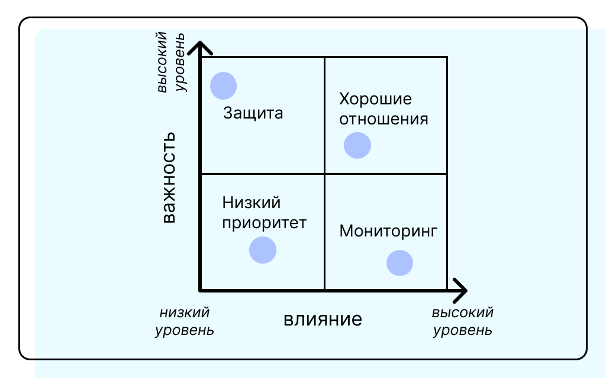

## Карьерный трек бизнес и системного аналитика(BSA)
#### Данный репозиторий отражает мою работу в рамках курса BSA от сбербанка, в котором я развиваю свои компетенций в качестве аналитика.

## Содержание
- [✓] [Заинтересованные стороны](#stakeholders---они-же-заинтересованные-стороны)
- [✓] [Требования](#требования)
- [✓] [Как составлять требования](#как-составлять-требования)
- [✓] [Предметная область](#предметная-область)
- [✓] [Диаграммы](#диаграммы)
- [✓] [BPMN](#bpmn)
- [✓] [UserStory - Пользовательские истории](#userstory)
- [✓] [UseCase - Пользовательские сценарии](#usecase)
- [ ] [Объекты и роли](#objects_and_roles)
- [ ] [Функциональные требования](#functionalrequirements)
- [ ] [UserInterfaces - Пользовательские интерфейсы](#userinterfaces)
- [ ] [Нефункциональные требования](#nonfunctionalrequirements)
- [ ] [Менеджемент требования](#requirementsmanagement)
- [ ] [Системная интеграция](#systemintegrations)
- [ ] [REST](#rest)
- [ ] [SOAP](#soap)
## Stakeholders - Они же заинтересованные стороны
Лица или группы людей, которые имеют интерес или возможность влиять на принятия решений. Почему интерес также важно?

Люди могут переходить из категорию в категорию и стоит пересматривать влияние уже выявленных стейкхолдеров через определенные промежутки времени, а также развивать лояльность у тех, кто потенциально может стать важной единицей в будущем. Важно уметь работать с ними и подмечать их истинные интересы, так выйдет плодотворное сотрудничество и минимизация рисков 
__полезная статейка на [Хабрахабре](https://habr.com/ru/companies/yandex_praktikum/articles/818405/)__

## Требования
Показывают как в системе все должно быть реализовано с точки зрения спецификации. Определяют границы проекта и помогают избежать недопонимания между стейкхолдерами и командами разработки, также помогают служат основой для тестирования и валидации самой системы. 
Делятся на:
1) Функциональные требования - описывают, что система должна делать, как реагировать и какие функции выполнять.
2) Нефункциональные - описывают, как система должна выполнять свои функции. Качество, производительность, ограничения...
3) Бизнес - высокоуровневые требования, которые определяют цели и задачи бизнеса.
4) Пользовательские - потребности и ожидания конечных пользователей.
 
Стоит рассматривать как систему в текущем проявлении(as is), так и желаемый результат(to be). Проводя параллели над имеющимся и желанным станет понятно на что стоит обратить внимание и выстроить шаги к достижению целей. 
Крайне важный этап для успешного ведения проекта.

## Как составлять требования
Составление требований - процесс, включающий в себя сбор, анализ и документирование требований заинтересованных сторон.
Методы сбора включают в себя интервью со стейкхолдерами, опросы конечных потребителей, наблюдения, анализ документации. Требования должны быть ясны и понятны, иметь приоритет, подвергаться валидации и быть доступны для обновлений. Как вариант, можно примерить на себя роли стейкхолдеров и посмотреть на систему с их стороны для более комплексного подхода и взгляда на систему.

## Предметная область
Это специфическая область знаний или деятельности, в рамках которой осуществляется система. Она включает в себя все аспекты и контекст, связанный с тематикой и бизнесом, а также в котором будут рассматриваться и выстраиваться требования и решения.
Аспекты можно разделить на:
1) Определение границ - предметная область определяет границы системы(что входит и не входит в нее). Помогает понять в каких рамках мы можем действовать.
2) Стейкхолдеры - определение ключевых лиц, понимание их ролей и потребностей.
3) Процессы и практики - каждая область их имеет свои специфические. Помогает в разработке решений, которые будут соответствовать ожиданиям
4) Язык и терминология - для эффективного общения между участниками проекта и его понимания
5) Проблемы - понимание уникальных проблем, специфичных для области. Помогает моделировать решения с их учетом, т е определение подводных камней области.

## Диаграммы
Служат для визуализации задач участников проекта. Также показывают как должна вести себя система в определенных условиях

## BPMN
Business Process Model and Notation - стандарт для моделирования бизнес процессов в виде графических диаграмм. Разработан для облегчения понимания и анализа бизнес процесссов как с точки зрения технических специалистов, так и внешних сторон.  
Среди преимуществ можно выделять ясность, универсальность, поддержка автоматизации и упрощение коммуникации между участниками.  
Мой фаворит - [StormBPMN](https://stormbpmn.com/) как удобный ресурс с АИ, который анализирует в реальном времени диаграмму на предмет соответствия принципам BPMN

## UserStory
Краткое и простое описание функциональности с точки зрения пользователя. Показывают, как пользователей может достичь конечного результата и что он хочет сделать. 
Содержат в cебя метрики успеха выполнения задач пользователем. 
**В кратком виде** - Как [пользователь], я хочу [действие], чтобы [цель/результат].

## UseCase
Метод описания взаимодействия между пользователей(актером) и системой для достижения желаемой цели. Помогают понять как будет вести себя система в разных условиях и служат основой для разработки требований и функциональности.
Содержат:
1) Актеры - пользователи/системы, взаимодействующие с системой в рамках конкретной задачи
2) Цель - то, чего хотим достичь
3) Основной поток - положительный сценарий, который желателен в большинстве случаев. Наиболее оптимальный путь достичь цели
4) Альтернативные потоки - способы достичь цели в случае если основной сценарий на любом из своих этапов не может быть осуществим
5) Предусловия - условия, которые должны быть выполнены до начала сценария
6) Постусловия - условия, которые должны быть истины после выполнения сценария

##### P.S. Будет дополняться в процессе и являться краткой выжимкой для меня по пройденным моментам
